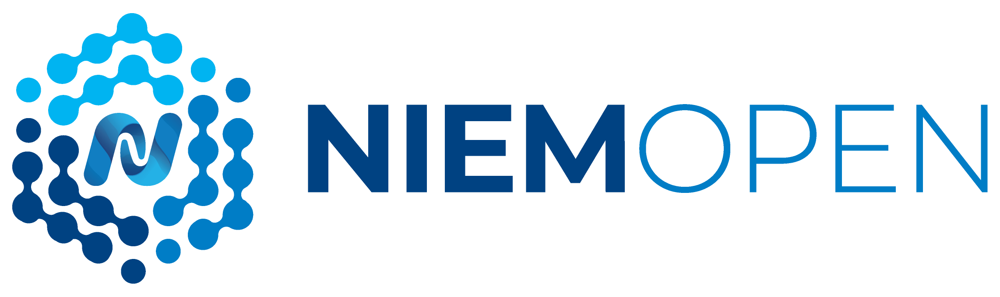

# Sponsors of NIEMOpen Project

OASIS Open and NIEMOpen thank the following organizations who generously support the work, funding the development of the interoperability standards and open source tools that their organizations and customers depend on.  

* [Equivant](https://www.equivant.com/)
* [Georgia Tech Research Institute](https://gtri.gatech.edu/)
* [IJIS Institute](https://ijis.org/) 
* [Joint Staff JS-J6 Command, Control, Communication, & Computers/Cyber (US)](https://www.jcs.mil/Directorates/J6-C4-Cyber/)
* [US Department of Homeland Security Science and Technology](https://www.dhs.gov/science-and-technology)
* [US Department of Transportation](https://www.transportation.gov/)
* [NAJIS (National Assoc. for Justice Information Systems)](https://www.najis.org/) (US)
* [Commonwealth of Virginia - Office of Data Governance & Analytics](https://www.odga.virginia.gov/)
* [Criminal Justice Information Services (CJIS) Division, Federal Bureau of Investigation](https://www.fbi.gov/services/cjis)
